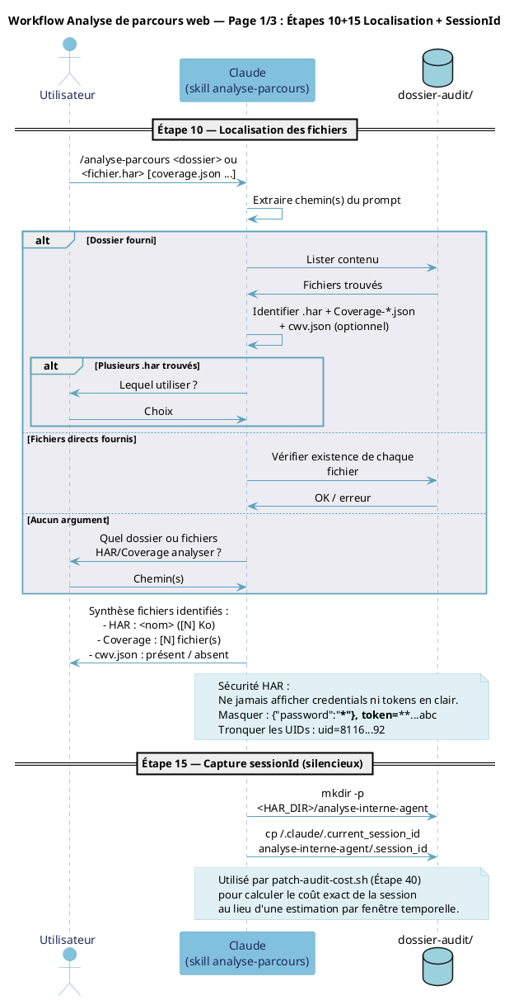
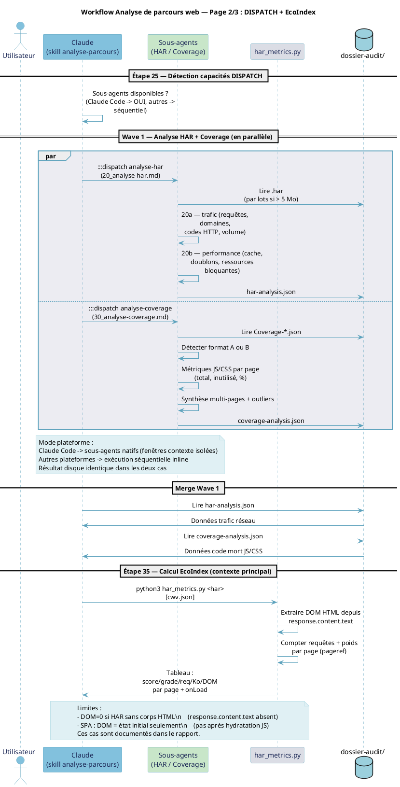
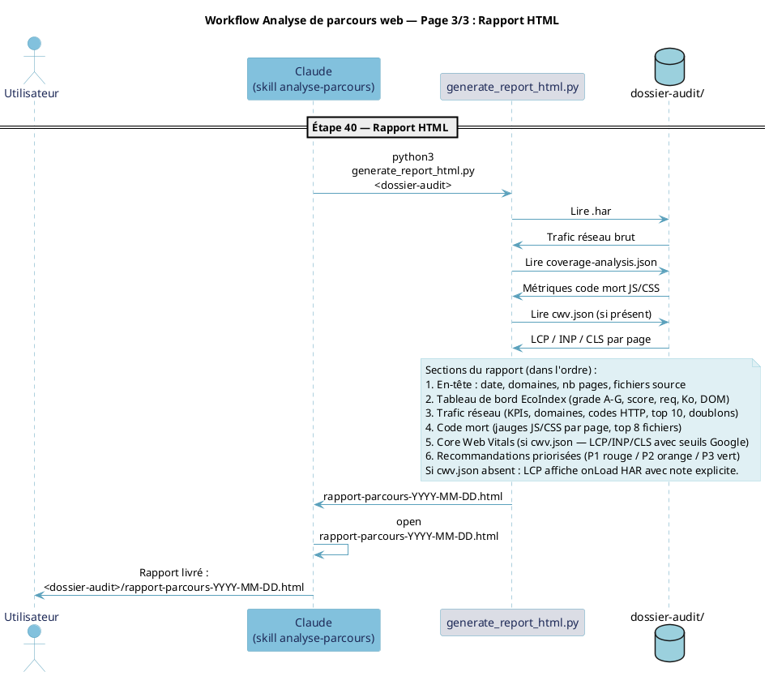
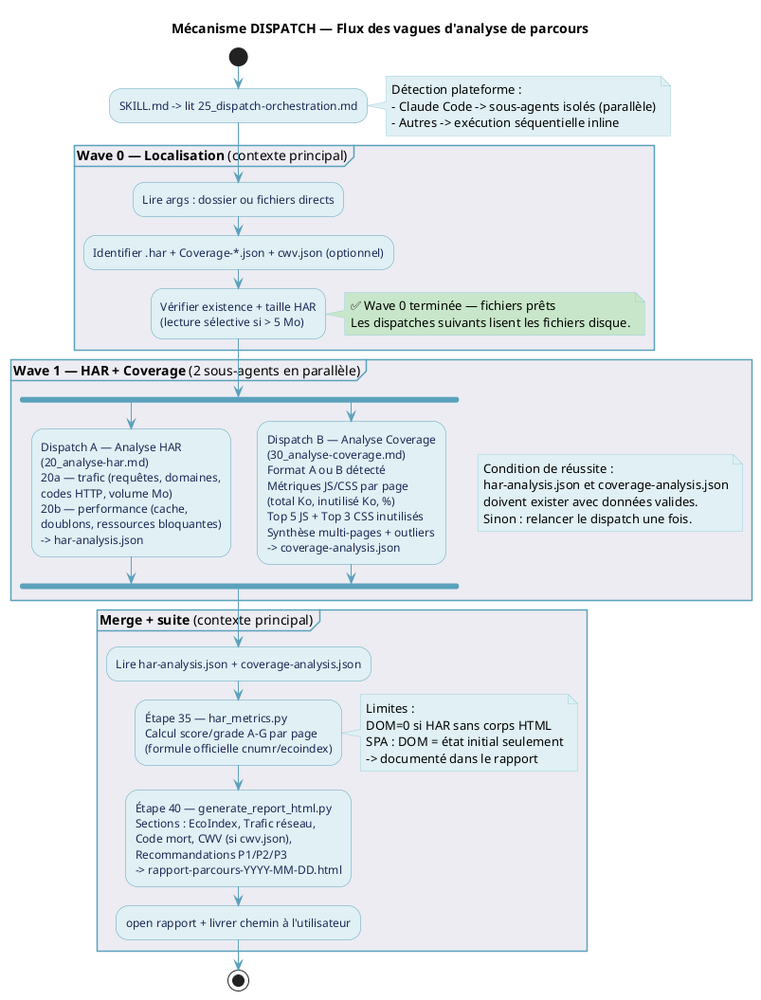

# Skill : Diagrammes — Analyse de parcours web

## Registre des diagrammes

| Diagramme | Fichiers source (`.puml`) | Fichiers produits | Source de vérité | Régénérer si... |
|-----------|--------------------------|-------------------|------------------|-----------------|
| Workflow principal (3 pages) | `analyse-parcours-p1.puml` `analyse-parcours-p2.puml` `analyse-parcours-p3.puml` | `analyse-parcours-workflow.pdf` | `analyse-parcours/SKILL.md` | SKILL.md change (étapes, participants) |
| DISPATCH — flux vagues (activité) | `analyse-parcours-dispatch-activite.puml` | `analyse-parcours-dispatch-activite.pdf` | `skill-steps/25_dispatch-orchestration.md` | `25_dispatch-orchestration.md` change (vagues, dispatches) |

Tous les fichiers `.puml` et les sorties se trouvent dans `diagramme/` à la racine du projet.

-----

## Procédure générale de régénération

Pour chaque diagramme modifié :
1. Modifier le `.puml` dans `diagramme/` en cohérence avec la source de vérité
2. Générer le SVG : `plantuml -tsvg <fichier>.puml`
3. Convertir en PDF via `rsvg-convert`
4. Vérifier + ouvrir

**Ne jamais générer directement en PNG ou PDF depuis plantuml.** Toujours passer par SVG (vecteur) puis `rsvg-convert` pour le PDF.

-----

## Diagramme 1 — Workflow principal (séquence)

**Source de vérité :** `analyse-parcours/SKILL.md` (sections Étape 10 à Étape 40)

### Structure des 3 fichiers

| Fichier | Participants | Étapes couvertes |
|---------|--------------|-----------------|
| `analyse-parcours-p1.puml` | U, C, FS | Étapes 10+15 — Localisation + Capture sessionId |
| `analyse-parcours-p2.puml` | U, C, SA, EI, FS | Étapes 25+35 — DISPATCH + EcoIndex |
| `analyse-parcours-p3.puml` | U, C, GR, FS | Étape 40 — Rapport HTML |

Découpage en 3 fichiers séparés : chaque page n'affiche que les participants actifs
(la technique `newpage` dans un mono-fichier ne réduit pas les colonnes).

### Commandes

```bash
plantuml -tsvg diagramme/analyse-parcours-p1.puml \
         diagramme/analyse-parcours-p2.puml \
         diagramme/analyse-parcours-p3.puml
rsvg-convert -f pdf -o diagramme/analyse-parcours-workflow.pdf \
  diagramme/analyse-parcours-p1.svg \
  diagramme/analyse-parcours-p2.svg \
  diagramme/analyse-parcours-p3.svg
ls -lh diagramme/analyse-parcours-workflow.pdf
open diagramme/analyse-parcours-workflow.pdf
```

### Contenu de référence — analyse-parcours-p1.puml



### Contenu de référence — analyse-parcours-p2.puml



### Contenu de référence — analyse-parcours-p3.puml



-----

## Diagramme 2 — DISPATCH (flux vagues d'analyse)

**Source de vérité :** `skill-steps/25_dispatch-orchestration.md`

### Description

Diagramme d'activité (syntaxe beta PlantUML) avec `fork` / `fork again` / `end fork`.
Représente le flux vertical des vagues avec les branches parallèles.
Mono-fichier, une seule page.

### Structure

```
Wave 0  — Localisation (contexte principal)
Wave 1  — Analyse HAR + Analyse Coverage en parallèle (2 sous-agents)
Merge   — lecture har-analysis.json + coverage-analysis.json
Suite   — Étape 35 EcoIndex + Étape 40 Rapport HTML (contexte principal)
```

### Commandes

```bash
plantuml -tsvg diagramme/analyse-parcours-dispatch-activite.puml
rsvg-convert -f pdf -o diagramme/analyse-parcours-dispatch-activite.pdf \
  diagramme/analyse-parcours-dispatch-activite.svg
ls -lh diagramme/analyse-parcours-dispatch-activite.pdf
open diagramme/analyse-parcours-dispatch-activite.pdf
```

### Contenu de référence — analyse-parcours-dispatch-activite.puml



-----

## Palette de couleurs OCTO

| Nom           | Hex       | Usage                                  |
|---------------|-----------|----------------------------------------|
| OctoDark      | `#1C2856` | Titre, texte FontColor                 |
| OctoWhite     | `#FFFFFF` | Fond général                           |
| OctoLightGrey | `#DBDDE5` | Scripts Python (ecoindex, generate)    |
| OctoPaleGrey  | `#ECECF2` | Fond groupes / partitions              |
| OctoPaleBlue  | `#E0F0F4` | Participants par défaut                |
| OctoLightBlue | `#9BD0DD` | dossier-audit (database)              |
| OctoBlue      | `#82C1DD` | Utilisateur, Claude                    |
| OctoDarkBlue  | `#5BA1BC` | Flèches, bordures, lifelines           |
| OctoDarkGrey  | `#67708E` | (non utilisé ici)                      |
| OctoGrey      | `#888FA8` | Notes secondaires                      |
| (extra)       | `#C8E6C9` | Sous-agents DISPATCH (vert pâle)       |

### Skinparam obligatoire

```plantuml
skinparam backgroundColor #FFFFFF
skinparam participant {
  BackgroundColor #E0F0F4
  BorderColor #5BA1BC
  FontColor #1C2856
}
skinparam actor {
  BackgroundColor #E0F0F4
  BorderColor #5BA1BC
  FontColor #1C2856
}
skinparam ArrowColor #5BA1BC
skinparam SequenceLifeLineBorderColor #5BA1BC
skinparam SequenceGroupBodyBackgroundColor #ECECF2
skinparam SequenceGroupBorderColor #5BA1BC
skinparam NoteBackgroundColor #E0F0F4
skinparam NoteBorderColor #9BD0DD
skinparam sequenceMessageAlign center
skinparam maxMessageSize 200
skinparam responseMessageBelowArrow true
```

-----

## Règles rédactionnelles

- Conserver les accents français (é, è, ê, à, ç...).
- Labels de messages courts (< 60 caractères si possible).
- `alt` / `loop` / `note` / `partition` en français.
- **Interdire les doubles tirets `--` dans les labels.** PlantUML interprète `--texte--`
  comme du texte barré. Utiliser un seul tiret `-`.
  Vérifier : `grep "\-\-" diagramme/*.puml` doit retourner 0 occurrence dans les lignes `-> ... :`.
