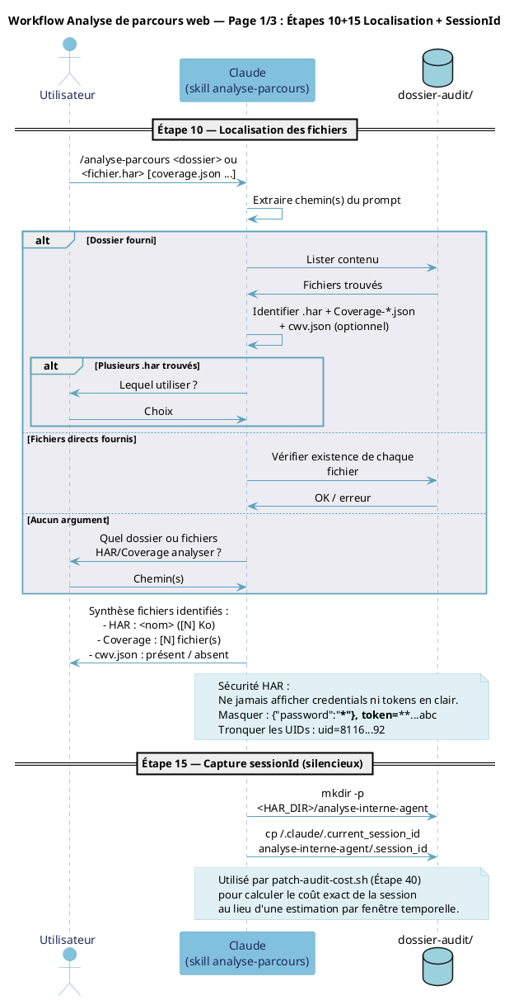
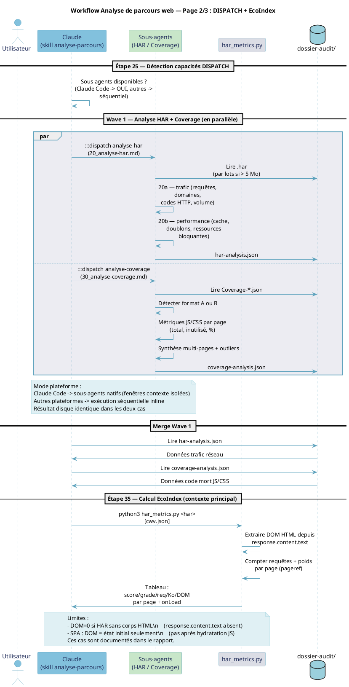
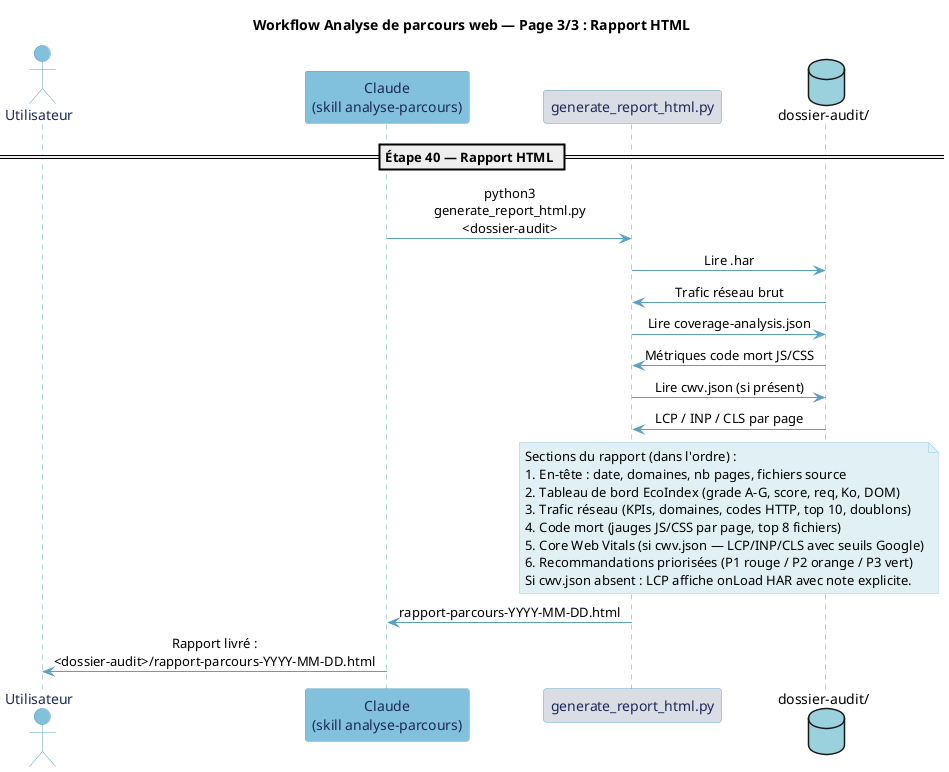
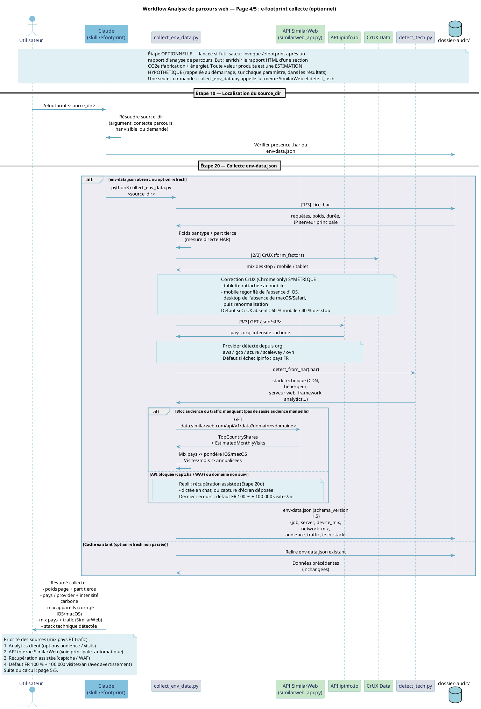
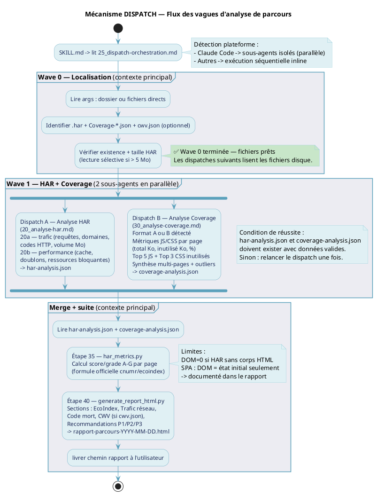

# Skill : Diagrammes — Analyse de parcours web

## Registre des diagrammes

| Diagramme | Fichiers source (`.puml`) | Fichiers produits | Source de vérité | Régénérer si... |
|-----------|--------------------------|-------------------|------------------|-----------------|
| Workflow principal (5 pages) | `analyse-parcours-p1.puml` `analyse-parcours-p2.puml` `analyse-parcours-p3.puml` `analyse-parcours-p4.puml` `analyse-parcours-p5.puml` | `analyse-parcours-workflow.pdf` | `analyse-parcours/SKILL.md` (p1-p3) + `analyse-parcours/skill-steps/45_efootprint.md` (p4-p5) | l'un des fichiers source change (étapes, participants) |
| DISPATCH — flux vagues (activité) | `analyse-parcours-dispatch-activite.puml` | `analyse-parcours-dispatch-activite.pdf` | `skill-steps/25_dispatch-orchestration.md` | `25_dispatch-orchestration.md` change (vagues, dispatches) |
| e-footprint — pipeline outils (activité) | `analyse-parcours-efootprint-outils.puml` | `analyse-parcours-efootprint-outils.pdf` | `collect_env_data.py` + `run_efootprint.py` + `generate_report_html.py` (code réel des scripts) | l'un de ces 3 scripts change ses entrées/sorties ou ses sous-outils appelés |
| e-footprint — topologie d'un site (composants) | GÉNÉRÉ à la demande, pas de `.puml` fixe en dépôt | variable (dépend du site/archétype demandé) | `efootprint_model/to_plantuml.py::site_to_plantuml()` (lit une `SiteSpec`) | jamais à régénérer soi-même : ce diagramme se produit en appelant `site_to_plantuml(spec)` sur la spec du moment, cf. section dédiée ci-dessous. Depuis l'Étape 25 du skill efootprint, produit AUSSI systématiquement (pas seulement à la demande ponctuelle), via `run_efootprint.py::build_topology_overview()`. Les hôtes tiers annotés d'une suspicion BDD/streaming/IA (`efootprint_model/topology_overview.py`) affichent leur note dans le label du composant. |
| EOF — pipeline outils (activité, 2 pages) | `eof-pipeline-outils.puml` (contient 2 diagrammes : `eof-pipeline-outils` + `eof-radar-svg`) | `eof-pipeline-outils.pdf` (2 pages) | `.claude/skills/eof/scripts/build_template.py` (page 1 : récupération gviz + construction du Markdown) + `.claude/skills/eof/scripts/generate_radar_svg.py` (page 2, pipeline indépendant) | l'un des 2 scripts change ses entrées/sorties, ou la liste des `gid`/onglets de la Google Sheet source change |
| EOF-audit — pipeline outils (activité) | `eof-audit-pipeline.puml` | `eof-audit-pipeline.pdf` | `.claude/skills/analyse-parcours/scripts/run_eof.py` + `eof_criteria_mapping.py` + les 3 extracteurs Phase 1 (`parse_html_criteria.py`, `analyze_security_headers.py`, `scan_wellknown.py`) + l'extension a11y/best-practices de `collect_cwv_pagespeed.py` | l'un de ces scripts change ses entrées/sorties, ou le nombre de critères automatisables/indices évolue (Phase 2, `eof-questionnaire`) |

Tous les fichiers `.puml` et les sorties se trouvent dans `documentation/diagrammes/` à la racine du projet.

-----

## Procédure générale de régénération

Pour chaque diagramme modifié :
1. Modifier le `.puml` dans `documentation/diagrammes/` en cohérence avec la source de vérité
2. Générer le SVG : `plantuml -tsvg <fichier>.puml`
3. Convertir en PDF via `rsvg-convert`
4. Vérifier + ouvrir

**Ne jamais générer directement en PNG ou PDF depuis plantuml.** Toujours passer par SVG (vecteur) puis `rsvg-convert` pour le PDF.

-----

## Diagramme 1 — Workflow principal (séquence)

**Source de vérité :** `analyse-parcours/SKILL.md` (pages 1-3, Étapes 10 à 40) +
`analyse-parcours/skill-steps/45_efootprint.md` (pages 4-5, Étapes 10 à 50 du skill /efootprint).

Le workflow assemble le parcours de base (p1-p3) ET le module e-footprint optionnel
(p4-p5). Les titres portent la numérotation globale « Page X/5 ».

### Structure des 5 fichiers

| Fichier | Participants | Étapes couvertes |
|---------|--------------|-----------------|
| `analyse-parcours-p1.puml` | U, C, FS | Étapes 10+15 — Localisation + Capture sessionId |
| `analyse-parcours-p2.puml` | U, C, SA, EI, FS | Étapes 25+35 — DISPATCH + EcoIndex |
| `analyse-parcours-p3.puml` | U, C, GR, FS | Étape 40 — CWV Lighthouse + Rapport HTML |
| `analyse-parcours-p4.puml` | U, C, CED, SW, IP, CR, DT, FS | e-footprint Étapes 10+20 — Collecte (SimilarWeb, CrUX+correction iOS/macOS, ipinfo, detect_tech) |
| `analyse-parcours-p5.puml` | U, C, REF, GR, FS | e-footprint Étapes 30+40+50 — Questions, calcul, synthèse, enrichissement rapport |

Découpage en fichiers séparés : chaque page n'affiche que les participants actifs
(la technique `newpage` dans un mono-fichier ne réduit pas les colonnes). Les pages
p4-p5 sont OPTIONNELLES (skill `/efootprint`) mais incluses dans le PDF assemblé.

### Commandes

```bash
plantuml -tsvg documentation/diagrammes/analyse-parcours-p1.puml \
         documentation/diagrammes/analyse-parcours-p2.puml \
         documentation/diagrammes/analyse-parcours-p3.puml \
         documentation/diagrammes/analyse-parcours-p4.puml \
         documentation/diagrammes/analyse-parcours-p5.puml
rsvg-convert -f pdf -o documentation/diagrammes/analyse-parcours-workflow.pdf \
  documentation/diagrammes/analyse-parcours-p1.svg \
  documentation/diagrammes/analyse-parcours-p2.svg \
  documentation/diagrammes/analyse-parcours-p3.svg \
  documentation/diagrammes/analyse-parcours-p4.svg \
  documentation/diagrammes/analyse-parcours-p5.svg
ls -lh documentation/diagrammes/analyse-parcours-workflow.pdf
open documentation/diagrammes/analyse-parcours-workflow.pdf
```

### Contenu de référence — analyse-parcours-p1.puml



### Contenu de référence — analyse-parcours-p2.puml



### Contenu de référence — analyse-parcours-p3.puml



### Contenu de référence — analyse-parcours-p4.puml

**Source de vérité :** `analyse-parcours/skill-steps/45_efootprint.md` (Étapes 10 et 20, y compris 20b/20c/20e
SimilarWeb, correction CrUX iOS/macOS) + `collect_env_data.py` (flux réel, défauts,
providers) + `detect_tech.py`. Points à revérifier si cette étape change : défaut mix
60 % mobile / 40 % desktop (pas 100 % desktop), providers supportés
`aws / gcp / azure / scaleway / ovh`, `schema_version` d'`env-data.json`, appel
SimilarWeb automatique intégré à `collect_env_data.py`.



### Contenu de référence — analyse-parcours-p5.puml

**Source de vérité :** `analyse-parcours/skill-steps/45_efootprint.md` (Étapes 30, 40, 50) + `run_efootprint.py`
(modèle Boavizta, schéma `efootprint-synthese-python.json`) + `generate_report_html.py`
(section CO2e). Points à revérifier si le code change : structure d'`efootprint-synthese-python.json`
(bloc `traffic`, `totals` avec dicts `fabrication_kg_co2e_per_year` / `energy_kg_co2e_per_year`,
gros bloc `hypotheses`), position de la section (entre CWV et Annexes), trafic réutilisé
depuis le bloc `traffic` s'il est déjà résolu.

```plantuml
@startuml analyse-parcours-p5
title Workflow Analyse de parcours web — Page 5/5 : e-footprint calcul + rapport (optionnel)

skinparam backgroundColor #FFFFFF
skinparam participant {
  BackgroundColor #E0F0F4
  BorderColor #5BA1BC
  FontColor #1C2856
}
skinparam actor {
  BackgroundColor #E0F0F4
  BorderColor #5BA1BC
  FontColor #1C2856
}
skinparam ArrowColor #5BA1BC
skinparam SequenceLifeLineBorderColor #5BA1BC
skinparam SequenceGroupBodyBackgroundColor #ECECF2
skinparam SequenceGroupBorderColor #5BA1BC
skinparam NoteBackgroundColor #E0F0F4
skinparam NoteBorderColor #9BD0DD
skinparam sequenceMessageAlign center
skinparam maxMessageSize 200
skinparam responseMessageBelowArrow true

actor "Utilisateur" as U #82C1DD
participant "Claude\n(skill /efootprint)" as C #82C1DD
participant "run_efootprint.py" as REF #DBDDE5
participant "generate_report_html.py" as GR #DBDDE5
database "dossier-audit/" as FS #9BD0DD

note over U, FS
  Suite de la page 4/5 : env-data.json est prêt. On demande les hypothèses non
  auto-détectables, on calcule, on synthétise, on enrichit le rapport HTML.
  Rappel : toute valeur reste une ESTIMATION HYPOTHÉTIQUE.
end note

== Étape 30 — Paramètres utilisateur ==

C -> C : Trafic déjà résolu (bloc traffic\nSimilarWeb ou analytics client) ?

alt Trafic déjà résolu (page 4)
  note over C : Ne pas reposer la question :\nréutiliser le volume résolu à l'Étape 20c.
else Aucune source de trafic
  C -> U : AskUserQuestion — trafic annuel\n(10k / 100k / 500k / 1M, ou libre)
  U -> C : Trafic retenu (option visits)
end

alt Provider cloud supporté détecté\n(aws / gcp / azure / scaleway / ovh)
  C -> U : AskUserQuestion — taille d'instance\n(ex. AWS : t3.medium défaut, t3.large, m5.large...)
  U -> C : Instance retenue (option instance)
else Provider inconnu ou non supporté
  note over C : Pas de question :\nrun_efootprint bascule sur Server générique.
end

note over C, U
  Toujours rappeler qu'il s'agit d'hypothèses.
  Poids, durée, mix appareils, pays : imposés par env-data.json
  (pour les changer, éditer env-data.json puis relancer).
end note

== Étape 40 — Calcul e-footprint ==

C -> REF : python3 run_efootprint.py <source_dir>\n[option visits N] [option instance TYPE]
REF -> FS : Lire env-data.json
FS -> REF : Données environnement

REF -> REF : Construire modèle Boavizta :\n- Devices (2 profils : mobile / desktop)\n- Network (mobile -> réseau mobile, desktop -> wifi)\n- Server (instance cloud ou générique)\n- Storage (hypothèse 50 GB)

REF -> REF : Calcul impact :\n- Fabrication (dict par poste)\n- Énergie (dict par poste)\n- Total kg/an + g/visite

REF -> FS : efootprint-boavizta-model.json\n(modèle complet sérialisé)
REF -> FS : efootprint-synthese-python.json\n(totaux + hypothèses, format léger)

note over REF, FS
  efootprint-synthese-python.json (extrait) :
  {
    "visits_per_year": ...,
    "traffic": {source, source_url, snapshot, confidence},
    "totals": {
      "total_kg_co2e_per_year": ...,
      "per_visit_g_co2e": ...,
      "fabrication_kg_co2e_per_year": {poste: kg},
      "energy_kg_co2e_per_year": {poste: kg}
    },
    "hypotheses": {
      page_weight_kb, request_duration_ms,
      weight_by_type_bytes, third_party_share,
      country, carbon_intensity_g_kwh, provider, instance_type,
      phone_fraction / desktop_fraction (corrigé iOS/macOS),
      audience_mix + source, device_scenarios,
      + niveau de confiance par champ
    }
  }
end note

REF -> C : stdout : tableau hypothèses\n+ résultats CO2e bruts

== Étape 50 — Synthèse et enrichissement rapport ==

C -> U : Synthèse (3 lignes) :\n- ~{total} kg CO2e/an\n- ~{per_visit} g CO2e/visite\n- Poste dominant : devices / server / network / storage

C -> U : AskUserQuestion — et ensuite ?\n- Relancer avec d'autres hypothèses\n- Recollecte (option refresh)\n- Régénérer le rapport HTML\n- Terminer

alt Régénérer le rapport HTML
  C -> GR : python3 generate_report_html.py <dossier-audit>
  GR -> FS : Lire efootprint-synthese-python.json\n(+ har, coverage, cwv, tech_stack)
  FS -> GR : Données rapport
  GR -> GR : Insérer section "Impact\nenvironnemental (CO2e)"\nentre CWV et Annexes
  GR -> FS : rapport-parcours-YYYY-MM-DD.html
  GR -> C : Chemin rapport
  C -> U : Rapport enrichi livré\n(KPIs CO2e, décomposition fab/énergie,\nannexe méthodologique A/B/C/D)
end

note over U, C
  Boucle humain-dans-la-boucle : aucune itération automatique.
  Section CO2e omise si efootprint-synthese-python.json absent (rapport rétro-compatible).
end note

@enduml
```



-----

## Diagramme 2 — DISPATCH (flux vagues d'analyse)

**Source de vérité :** `skill-steps/25_dispatch-orchestration.md`

### Description

Diagramme d'activité (syntaxe beta PlantUML) avec `fork` / `fork again` / `end fork`.
Représente le flux vertical des vagues avec les branches parallèles.
Mono-fichier, une seule page.

### Structure

```
Wave 0  — Localisation (contexte principal)
Wave 1  — Analyse HAR + Analyse Coverage en parallèle (2 sous-agents)
Merge   — lecture har-analysis.json + coverage-analysis.json
Suite   — Étape 35 EcoIndex + Étape 40 Rapport HTML (contexte principal)
```

### Commandes

```bash
plantuml -tsvg documentation/diagrammes/analyse-parcours-dispatch-activite.puml
rsvg-convert -f pdf -o documentation/diagrammes/analyse-parcours-dispatch-activite.pdf \
  documentation/diagrammes/analyse-parcours-dispatch-activite.svg
ls -lh documentation/diagrammes/analyse-parcours-dispatch-activite.pdf
open documentation/diagrammes/analyse-parcours-dispatch-activite.pdf
```

### Contenu de référence — analyse-parcours-dispatch-activite.puml



-----

## Diagramme 3 — e-footprint (pipeline outils CO2e)

**Source de vérité :** le code réel des 3 scripts (pas de doc markdown intermédiaire,
car les entrées/sorties précises — noms de champs JSON, sous-outils appelés — ne
sont fiables qu'en lisant le code) :
- `analyse-parcours/scripts/collect_env_data.py` (orchestrateur collecte : HAR,
  API CrUX, ipinfo.io, `detect_tech.py`, `similarweb_api.py`)
- `analyse-parcours/scripts/run_efootprint.py` (orchestrateur calcul : librairie
  e-footprint/Boavizta)
- `analyse-parcours/scripts/generate_report_html.py` (restitution section CO2e)

### Description

Diagramme d'activité (PlantUML) en 4 blocs séquentiels verticaux (format A4
portrait) : outils de collecte -> données récoltées (env-data.json) -> calcul
e-footprint/Boavizta -> restitution. Une étape de départ séparée représente la
capture manuelle Chrome DevTools (source du .har et du Coverage-*.json).

Le Bloc 1 liste les 5 sous-outils de `collect_env_data.py` dans leur ordre
d'exécution réel, avec une note explicite : ils sont **séquentiels**, pas en
parallèle (contrairement au DISPATCH HAR/Coverage du diagramme 1, qui utilise
de vrais sous-agents concurrents). Vérifié en lisant le code, pas supposé.
Les notes de paramètres CLI (Blocs 2 et 3) sont volontairement compactes (une
ligne, noms de flags seulement, sans description).

Différence avec le diagramme 1 (workflow séquence, pages 4-5) : celui-ci se
concentre sur les **outils et leurs contrats de données** (paramètres CLI, champs
JSON en entrée/sortie), pas sur l'échange de messages entre l'utilisateur et Claude.

### Commandes

```bash
plantuml -tsvg documentation/diagrammes/analyse-parcours-efootprint-outils.puml
rsvg-convert -f pdf -o documentation/diagrammes/analyse-parcours-efootprint-outils.pdf \
  documentation/diagrammes/analyse-parcours-efootprint-outils.svg
ls -lh documentation/diagrammes/analyse-parcours-efootprint-outils.pdf
open documentation/diagrammes/analyse-parcours-efootprint-outils.pdf
```

### Pièges rencontrés à la génération

- Un point-virgule `;` à l'intérieur du texte d'un label d'activité multi-lignes
  est interprété par PlantUML comme la fin du nœud d'activité et casse le
  parsing plus loin dans le fichier (erreur reportée sur une ligne ultérieure,
  pas sur le `;` lui-même). Éviter tout `;` dans le corps d'un label `:texte;`
  — utiliser une virgule à la place.
- Un flag CLI écrit avec son double-tiret dans un label ou une note (ex.
  `--audience`, `--visits`) est interprété par PlantUML (syntaxe creole) comme
  un marqueur de texte barré, à partir du `--` jusqu'au prochain `,` ou `;`.
  Écrire les noms de flags sans le préfixe `--` dans les notes (ex. `audience`,
  `visits`) pour éviter ce rendu barré.
- Rester cohérent sur le vocabulaire employé dans les labels (ex. toujours
  "parsing", jamais mélanger avec "parse"/"parsé") — les incohérences de terme
  entre blocs sautent aux yeux sur un diagramme court.

-----

## Diagramme 4 — e-footprint (topologie technique d'un site, composants)

**Source de vérité :** `efootprint_model/to_plantuml.py::site_to_plantuml()`. Différence
fondamentale avec les diagrammes 1 à 3 : ceux-là décrivent le CODE des scripts (toujours les
mêmes participants, un seul `.puml` par diagramme, régénéré quand le code change). Celui-ci
décrit une DONNÉE (une `SiteSpec` particulière : le site audité, ou un archétype, ou une
composition) : il n'existe pas de `.puml` fixe à maintenir en dépôt, chaque appel produit un
diagramme différent selon la spec qu'on lui donne.

### Description

Diagramme de composants (pas de séquence, pas d'activité) : QUI existe et QUI parle à QUI,
jamais l'ordre des étapes du parcours utilisateur (ça reste le rôle des pages 4-5 du
diagramme 1). Contenu, par package :
- **Serveurs 1st-party** : un composant `database` par `ServerSpec` de la spec.
- **Traitements** : un composant `component` par `JobSpec` SANS appel IA, relié à son
  serveur (`-down->`).
- **Appels IA générative** : un composant `cloud` par `JobSpec` qui porte un
  `ExternalApiSpec` (cf. Lot 7, calcul réel via EcoLogits), avec le provider/modèle affiché
  dans le label. Séparé des traitements réseau habituels : ce n'est pas la même nature de
  coût (cf. handoff du 10/08/2026, section 2.4 sur le contraste CDN/tiers vs IA).
- **Hôtes tiers (réseau seulement)** : un composant `cloud` par `ThirdPartyHost`, si la spec
  en porte.

### Utilisation

```python
import sys
sys.path.insert(0, ".claude/skills/analyse-parcours/scripts")
from efootprint_model.to_plantuml import site_to_plantuml

# Depuis une spec réelle (from_har.py) ou un archétype (archetypes/*.py) :
puml_text = site_to_plantuml(spec)
open("mon_diagramme.puml", "w").write(puml_text)
```

```bash
plantuml -tsvg mon_diagramme.puml
rsvg-convert -f pdf -o mon_diagramme.pdf mon_diagramme.svg
```

### Piège rencontré à la génération

`@startuml <id>` PILOTE LE NOM DU FICHIER produit par `plantuml` quand aucun `-o` explicite
n'est passé. Un titre de site avec espaces/accents/parenthèses (nom réel d'un domaine, ou
nom d'archétype avec préfixe fictif) donnerait un nom de fichier fragile selon la
plateforme. `to_plantuml.py` sépare donc l'IDENTIFIANT technique (`@startuml <id>`, ASCII
strict, dérivé du nom du site) du TITRE AFFICHÉ (ligne `title`, accents et espaces
conservés) : c'est l'identifiant, pas le titre, qui détermine le nom du fichier de sortie.

-----

## Diagramme 5 — EOF (pipeline outils, 2 pages)

**Source de vérité :** `.claude/skills/eof/scripts/build_template.py` (page 1) et
`.claude/skills/eof/scripts/generate_radar_svg.py` (page 2) — code réel des scripts,
comme le diagramme 3 (pas de doc markdown intermédiaire pour les entrées/sorties
précises).

### Description

Skill séparé de `analyse-parcours` (référentiel EOF-V.1.1, EROOM Optimization
Framework). Deux pipelines représentés dans UN SEUL fichier `.puml` contenant 2
diagrammes d'activité (2 blocs `@startuml`/`@enduml`) :

- **Page 1 (`eof-pipeline-outils`)** : récupération des 9 onglets de la Google
  Sheet source via l'API `gviz` (un `gid` par onglet — les exports CSV/XLSX
  classiques échouent, redirection à jeton à usage unique), puis construction du
  template Markdown vierge par `build_template.py` (3 formats d'évaluation
  différents selon l'onglet : échelle 1-5, menu à 5 choix, menu à 3 choix propre
  à "Facilité de changement").
- **Page 2 (`eof-radar-svg`)** : `generate_radar_svg.py`, INDÉPENDANT de la page 1
  (ne consomme pas sa sortie) — calcule un radar SVG par trigonométrie pure,
  sans bibliothèque de graphique.

### Commandes

```bash
plantuml -tsvg documentation/diagrammes/eof-pipeline-outils.puml
rsvg-convert -f pdf -o documentation/diagrammes/eof-pipeline-outils.pdf \
  documentation/diagrammes/eof-pipeline-outils.svg \
  documentation/diagrammes/eof-radar-svg.svg
ls -lh documentation/diagrammes/eof-pipeline-outils.pdf
open documentation/diagrammes/eof-pipeline-outils.pdf
```

### Piège rencontré à la vérification

Un rendu PNG rapide via `rsvg-convert -w <largeur> fichier.svg -o fichier.png` (sans
option de fond) affiche un fond NOIR même quand le `.puml` porte
`skinparam backgroundColor #FFFFFF` : PlantUML écrit ce blanc comme un style CSS
(`style="...background:#FFFFFF;"`) sur la balise `<svg>` racine, que `rsvg-convert`
ignore par défaut en conversion PNG (zones transparentes rendues noires). Le SVG et
le PDF finaux sont corrects (vérifié en ouvrant le vrai PDF) — pour une vérification
PNG fidèle, forcer le fond explicitement : `rsvg-convert -b white ...`.

-----

## Diagramme 6 — EOF-audit (pipeline outils, étape de `analyse-parcours`)

**Source de vérité :** `.claude/skills/analyse-parcours/scripts/run_eof.py` +
`eof_criteria_mapping.py` + les 3 extracteurs Phase 1 (`parse_html_criteria.py`,
`analyze_security_headers.py`, `scan_wellknown.py`) + l'extension
accessibility/best-practices de `collect_cwv_pagespeed.py` — code réel des
scripts, comme les diagrammes 3 et 5.

### Description

Distinct du diagramme 5 (skill `eof` : fabrication du template vierge depuis la
Google Sheet) : celui-ci représente l'**étape `eof-audit`** de `analyse-parcours`,
qui remplit ce template pour un site audité précis, à partir des données déjà
collectées (HAR, Coverage, e-footprint, CWV) et de 3 extracteurs ajoutés en
Phase 1 (2026-09-03, plan `eof-questionnaire`) :

- `parse_html_criteria.py` : re-fetch live des pages déjà auditées (le `.har`
  capturé ne contient pas les corps de réponse HTML/CSS).
- `analyze_security_headers.py` : score sécurité local depuis les en-têtes déjà
  présents dans le `.har`.
- `scan_wellknown.py` : fetch direct de 3 fichiers publics standards du domaine.

Résultat : 7 critères détaillés automatisables (était 4) + 11 indices "partiel"
(était 6), sur les 54 du référentiel — 36 restent "je ne sais pas" (questions
organisationnelles/produit, hors de portée de toute donnée technique d'audit).

### Commandes

```bash
plantuml -tsvg documentation/diagrammes/eof-audit-pipeline.puml
rsvg-convert -f pdf -o documentation/diagrammes/eof-audit-pipeline.pdf \
  documentation/diagrammes/eof-audit-pipeline.svg
open documentation/diagrammes/eof-audit-pipeline.pdf
```

-----

## Palette de couleurs OCTO

| Nom           | Hex       | Usage                                  |
|---------------|-----------|----------------------------------------|
| OctoDark      | `#1C2856` | Titre, texte FontColor                 |
| OctoWhite     | `#FFFFFF` | Fond général                           |
| OctoLightGrey | `#DBDDE5` | Scripts Python (ecoindex, generate)    |
| OctoPaleGrey  | `#ECECF2` | Fond groupes / partitions              |
| OctoPaleBlue  | `#E0F0F4` | Participants par défaut                |
| OctoLightBlue | `#9BD0DD` | dossier-audit (database)              |
| OctoBlue      | `#82C1DD` | Utilisateur, Claude                    |
| OctoDarkBlue  | `#5BA1BC` | Flèches, bordures, lifelines           |
| OctoDarkGrey  | `#67708E` | (non utilisé ici)                      |
| OctoGrey      | `#888FA8` | Notes secondaires                      |
| (extra)       | `#C8E6C9` | Sous-agents DISPATCH (vert pâle)       |

### Skinparam obligatoire

```plantuml
skinparam backgroundColor #FFFFFF
skinparam participant {
  BackgroundColor #E0F0F4
  BorderColor #5BA1BC
  FontColor #1C2856
}
skinparam actor {
  BackgroundColor #E0F0F4
  BorderColor #5BA1BC
  FontColor #1C2856
}
skinparam ArrowColor #5BA1BC
skinparam SequenceLifeLineBorderColor #5BA1BC
skinparam SequenceGroupBodyBackgroundColor #ECECF2
skinparam SequenceGroupBorderColor #5BA1BC
skinparam NoteBackgroundColor #E0F0F4
skinparam NoteBorderColor #9BD0DD
skinparam sequenceMessageAlign center
skinparam maxMessageSize 200
skinparam responseMessageBelowArrow true
```

-----

## Règles rédactionnelles

- Conserver les accents français (é, è, ê, à, ç...).
- Labels de messages courts (< 60 caractères si possible).
- `alt` / `loop` / `note` / `partition` en français.
- **Interdire les doubles tirets `--` dans les labels.** PlantUML interprète `--texte--`
  comme du texte barré. Utiliser un seul tiret `-`.
  Vérifier : `grep "\-\-" documentation/diagrammes/*.puml` doit retourner 0 occurrence dans les lignes `-> ... :`.
