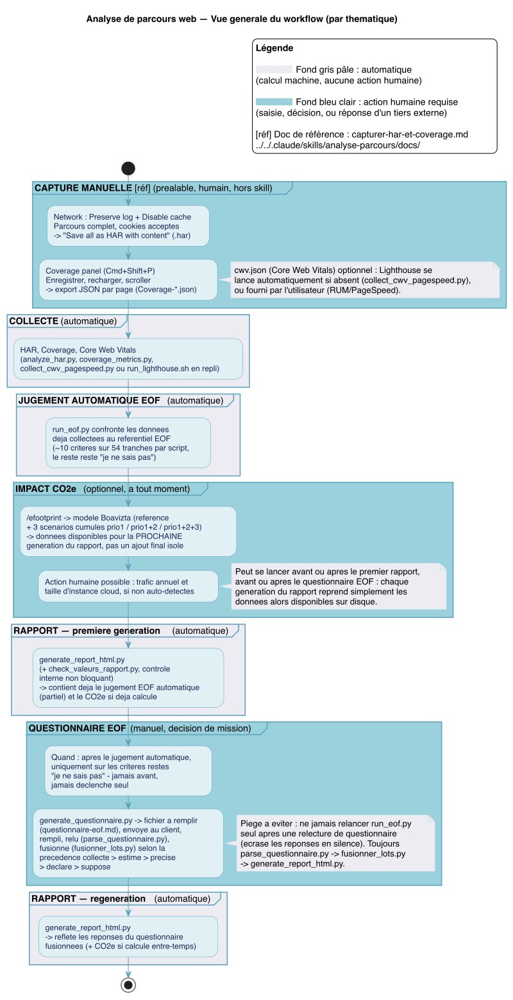
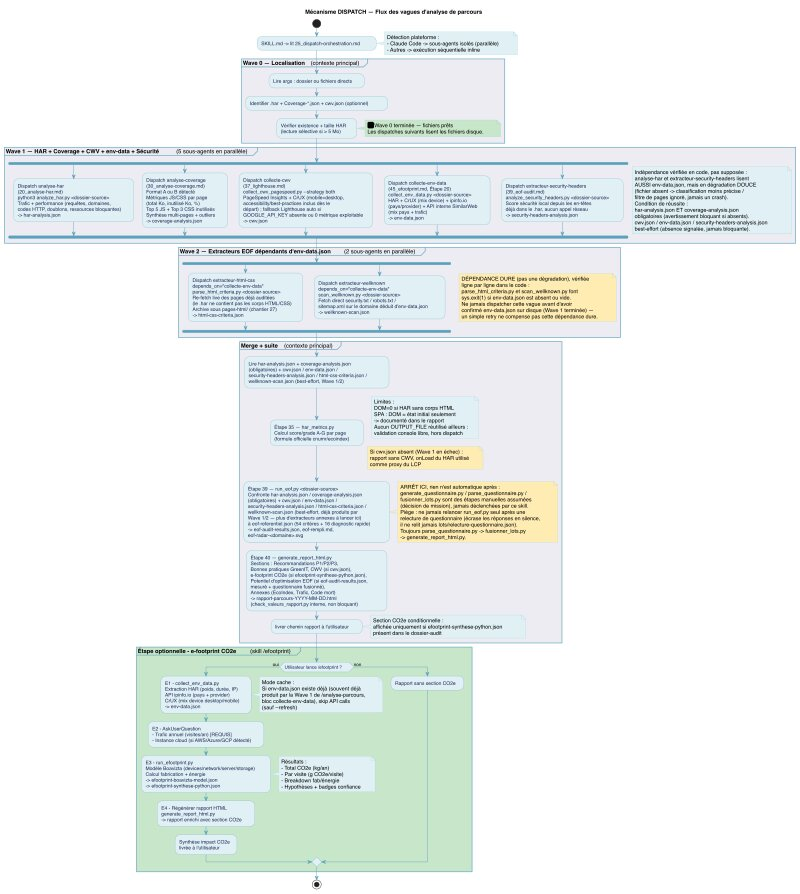
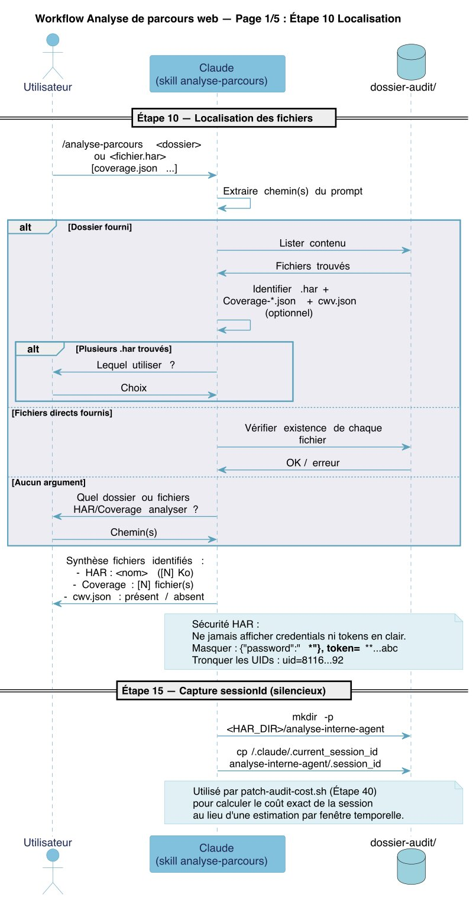
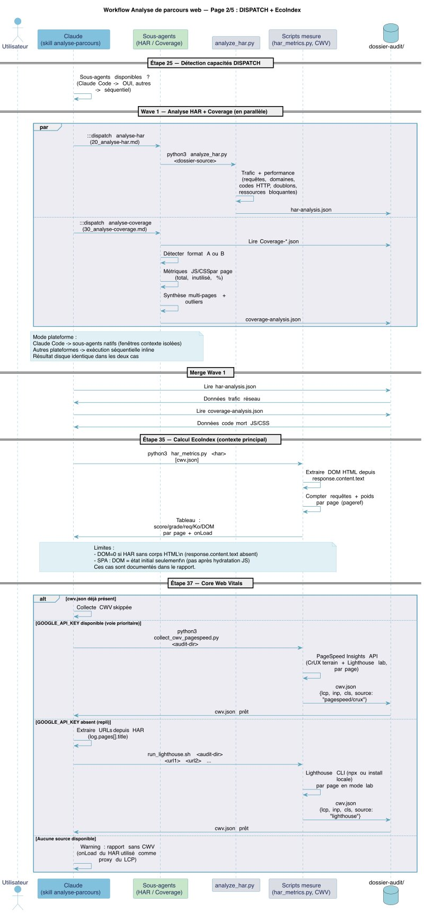
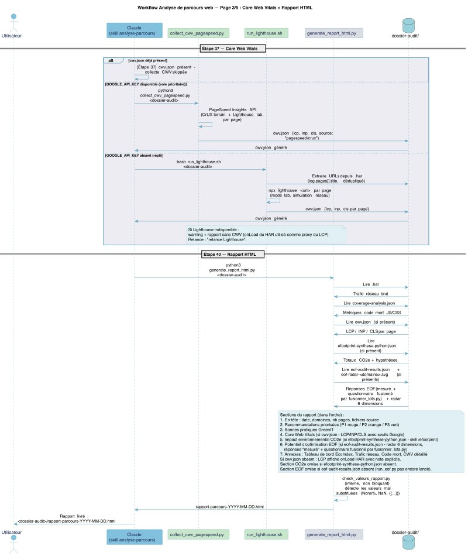
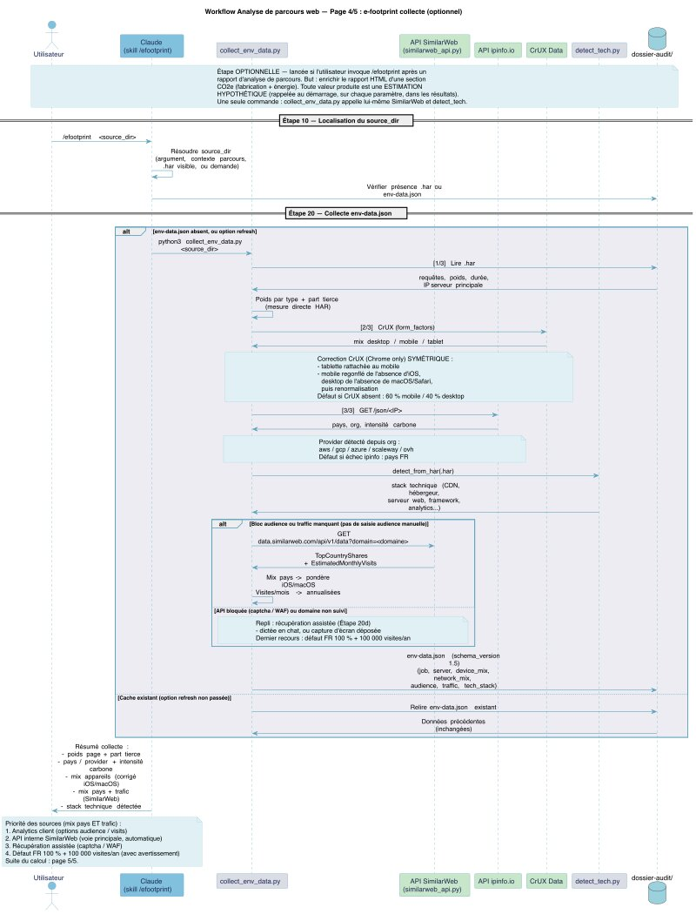
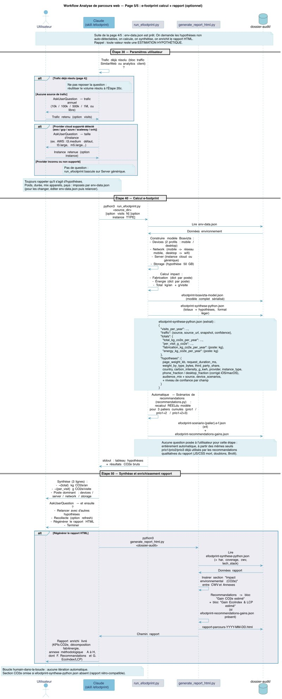
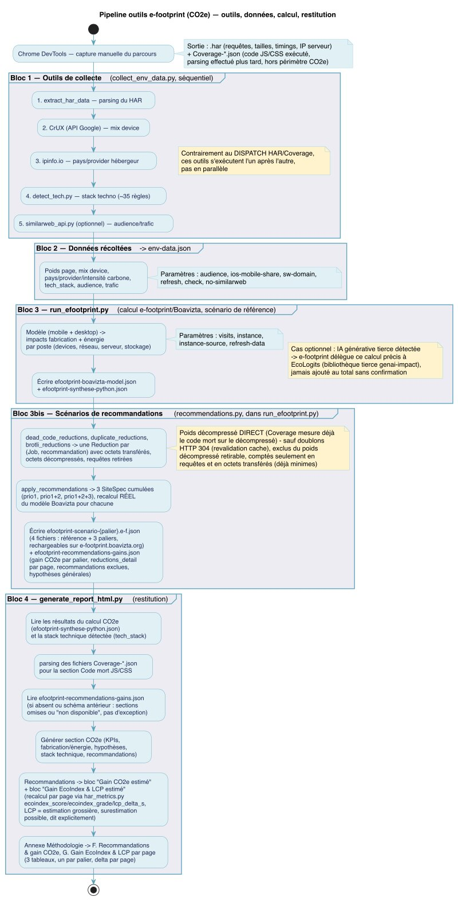

DISCLAIMER : CECI EST UN TRAVAIL EN COURS ET N’A PAS ÉTÉ VALIDÉ PAR LA COMMUNAUTÉ BOAVIZTA. 

# Agent EROOM

Outils et référentiels pour diagnostiquer l'impact environnemental d'un service numérique, à partir de données réelles plutôt que de moyennes génériques.

## Pourquoi ce projet existe

La plupart des estimations d'empreinte numérique reposent sur des hypothèses génériques : un "poids de page moyen", un "temps de visite moyen", un mix d'appareils moyen. Ces moyennes masquent ce qui se passe réellement pour un utilisateur donné, sur un parcours donné.

EROOM part d'un principe simple : mesurer d'abord ce qui se passe vraiment (le trafic réseau réellement capturé, le code réellement exécuté, les hôtes tiers réellement contactés), puis construire l'estimation par-dessus cette mesure, jamais à sa place. Quand une hypothèse générique est malgré tout nécessaire (durée de vie du matériel, intensité carbone électrique, longueur de réponse d'une IA générative...), elle est explicitée : sa valeur, sa source, son niveau de confiance sont tracés et affichés, jamais noyés dans un chiffre final présenté comme certain.

Deux autres principes guident les choix du projet :

- **Multi-critère plutôt que mono-critère.** Un parcours web se regarde sous plusieurs angles à la fois : trafic réseau, code mort, performance perçue (Core Web Vitals), empreinte carbone. Aucun de ces angles ne remplace les autres.
- **Un humain garde la main.** Les estimations produites nourrissent une décision humaine (prioriser, arbitrer, alerter), elles ne l'automatisent pas. Aucune boucle n'agit seule sur la base d'un résultat.

## Ce que contient le dépôt

Le projet regroupe trois familles d'outils, complémentaires mais indépendantes :

### `analyse-parcours` : diagnostic technique d'un parcours web

À partir d'une capture HAR (trafic réseau, export Chrome DevTools) et de fichiers de couverture JS/CSS, ce skill produit un rapport HTML avec :

- le détail du trafic réseau (requêtes, domaines, volumes, codes HTTP) ;
- le score EcoIndex (0 à 100, grade A à G) et le code mort JS/CSS ;
- les Core Web Vitals (données terrain via PageSpeed Insights/Chrome UX Report, à défaut mesurés en laboratoire via Lighthouse) ;
- des recommandations croisées avec la stack technique détectée.

→ `.claude/skills/analyse-parcours/`

### `efootprint` : estimation CO2e du parcours

Étape optionnelle du même skill, qui réutilise les données déjà capturées (HAR, mix d'appareils CrUX, pays et hébergeur du serveur via ipinfo.io, trafic annuel SimilarWeb) pour construire un modèle avec la bibliothèque [e-footprint](https://github.com/Boavizta/e-footprint) de Boavizta, et insère une section "Impact environnemental" dans le rapport. Quand le parcours appelle une IA générative tierce, e-footprint délègue ce calcul précis à une bibliothèque tierce, EcoLogits.

Ce que la bibliothèque e-footprint mesure, sur quoi elle repose et où sont ses limites est documenté sans détour dans `documentation/implementation/methodologie_efootprint.md`.

→ `.claude/skills/analyse-parcours/scripts/efootprint_model/`

### Référentiel EROOM : diagnostic rapide d'éco-conception

Une grille de qualification à 16 critères / 6 piliers, dérivée du référentiel EOF, revue pour que chaque critère soit une vraie question de degré et que chaque évaluation soit reproductible d'une personne (ou d'un agent) à l'autre.

→ `.claude/skills/analyse-parcours/docs/Référenciel EROOM/`

-----

## Diagrammes

Vue générale du workflow (par thématique), du recueil manuel du parcours jusqu'à la régénération du rapport après questionnaire :



Zoom sur l'étape DISPATCH (répartition de l'analyse HAR/Coverage en 2 sous-agents parallèles) :



Workflow principal en diagramme de séquence (5 pages : localisation, DISPATCH, rapport, puis collecte et calcul e-footprint) :











Pipeline outils de l'estimation e-footprint (collecte → calcul Boavizta → scénarios de recommandations → restitution) :



Versions imprimables (PDF) : [vue générale](documentation/diagrammes/analyse-parcours-vue-generale.pdf) · [DISPATCH](documentation/diagrammes/analyse-parcours-dispatch-activite.pdf) · [workflow (séquence, 5 pages)](documentation/diagrammes/analyse-parcours-workflow.pdf) · [e-footprint (pipeline outils)](documentation/diagrammes/analyse-parcours-efootprint-outils.pdf).

Les sources `.puml`/`.svg` et la procédure de régénération (registre complet de tous les diagrammes du projet) sont documentées dans le skill `.claude/skills/diagrammes-analyse-parcours/SKILL.md`.

-----

## Structure du dépôt

```
.
├── .claude/skills/
│   ├── analyse-parcours/                      # Le skill principal (diagnostic + e-footprint)
│   │   ├── SKILL.md                           # Workflow complet (référence technique)
│   │   ├── docs/                              # Guides (capture HAR/Coverage, clés API...)
│   │   ├── skill-steps/                       # Étapes détaillées du workflow
│   │   └── scripts/                           # analyze_har.py, run_efootprint.py, efootprint_model/...
│   ├── diagrammes-analyse-parcours/           # Skill de génération/maintenance des diagrammes
│   └── eof/                                   # Skill de fabrication du template EOF (référentiel source)
├── audits/<nom-du-site-audité>/                # Résultats d'audits réels (rapports HTML, e-footprint, EOF, topologie)
├── documentation/
│   ├── diagrammes/                            # Diagrammes PlantUML (.puml, .svg, .pdf, .jpg, .pptx)
│   └── implementation/                        # Méthodologie e-footprint, setup clés API
├── EOF_study_Quick_and_fast_first_questionary/  # Étude du référentiel EOF -> questionnaire
├── exemples fictifs radar EOF/                 # Démonstration du rendu radar SVG (données fictives)
├── processus/                                  # Fusion multi-agents des lots d'analyse EOF
├── LICENSE
└── README.md
```

Sous `audits/`, les données brutes potentiellement sensibles (`donnees-brutes-potentiellement-sensibles/`, `pages-html/`, `PERIMETRE-CAPTURE.md`) sont exclues du dépôt à n'importe quelle profondeur.

-----

## Prérequis

- [Claude Code](https://claude.com/claude-code)
- **Google Chrome** — capture manuelle du HAR et des données de couverture JS/CSS via DevTools (voir `.claude/skills/analyse-parcours/docs/capturer-har-et-coverage.md`)
- **Python 3**, avec la bibliothèque [`e-footprint`](https://github.com/Boavizta/e-footprint) (estimation CO2e)
- **Node.js** — pour Lighthouse (mesure Core Web Vitals en repli si les données terrain CrUX/PageSpeed ne sont pas disponibles), installé une seule fois via `npm install --prefix .claude/skills/analyse-parcours/scripts/`
- **Clés API personnelles** : PageSpeed Insights/Chrome UX Report et ipinfo.io (voir `documentation/implementation/setup_Google_api_keys.md`)
- Pour régénérer les diagrammes : `plantuml`, `rsvg-convert`, `magick` (ImageMagick) et `soffice` (LibreOffice, pour l'export `.pptx`)

-----

## Installation

```bash
git clone <URL_du_dépôt_distant>/eroom.git
cd eroom
```

Ouvrir le dossier avec Claude Code : les skills (`analyse-parcours`, `diagrammes-analyse-parcours`, `eof`) sont détectés automatiquement (`.claude/skills/`).

-----

## Démarrage rapide

Ces outils s'utilisent depuis [Claude Code](https://claude.com/claude-code), sous forme de skills invoqués en langage naturel ou par commande explicite :

```
/analyse-parcours <dossier-contenant-le-har-et-les-fichiers-de-couverture>
/efootprint <même-dossier>          # estimation CO2e seule
```

## Statut

Projet actif, développé au fil des audits réels. Les décisions structurantes et les limites connues sont documentées dans `documentation/` ; l'historique détaillé des choix vit dans les messages de commit.

## Licence

Ce dépôt est distribué sous licence [Creative Commons Attribution-ShareAlike 4.0 International (CC BY-SA 4.0)](https://creativecommons.org/licenses/by-sa/4.0/). Voir `LICENSE`.

### Projets et services tiers utilisés

Le code de ce dépôt s'appuie sur ses propres scripts pour capturer et analyser les données (HAR, couverture JS/CSS...), mais délègue certains calculs ou certaines données à des projets et services tiers, listés ci-dessous avec leur origine, leurs auteurs et leur licence :

- [e-footprint](https://github.com/Boavizta/e-footprint) (modélisation CO2e du parcours) — Boavizta / Vincent Villet (Publicis Sapient) — [AGPL-3.0](https://www.gnu.org/licenses/agpl-3.0.html)

  - [boaviztapi](https://github.com/Boavizta/boaviztapi) (données/calculs d'impact matériel, utilisé par e-footprint) — Boavizta — [AGPL-3.0](https://www.gnu.org/licenses/agpl-3.0.html)

  - [EcoLogits](https://github.com/mlco2/ecologits) (calcul d'impact des appels à une IA générative tierce, délégué par e-footprint) — mlco2, Samuel Rincé et Adrien Banse — [MPL-2.0](https://www.mozilla.org/en-US/MPL/2.0/)

- [PageSpeed Insights](https://developers.google.com/speed/docs/insights/v5/about) (API, données terrain et lab) — Google — service sous [conditions d'utilisation des API Google](https://developers.google.com/terms)

- [Chrome UX Report (CrUX)](https://developer.chrome.com/docs/crux) (données terrain P75, via l'API PageSpeed Insights) — Google — données sous [CC BY 4.0](https://creativecommons.org/licenses/by/4.0/)

- [Lighthouse](https://github.com/GoogleChrome/lighthouse) (mesure de repli des Core Web Vitals en laboratoire) — Google (GoogleChrome) — [Apache-2.0](https://github.com/GoogleChrome/lighthouse/blob/main/LICENSE)

- [GreenIT-Analysis](https://github.com/cnumr/GreenIT-Analysis) (méthode de mesure DOM/poids de page dont s'inspire `analyze_har.py`) — © EcoIndex.fr / Frédéric Bordage, auteurs d'EcoMeter, didierfred@gmail.com, maintenu par CNumr — [AGPL-3.0](https://www.gnu.org/licenses/agpl-3.0.html)

- [EcoIndex](https://github.com/cnumr/ecoindex_reference) (formule de calcul du score, reprise dans `har_metrics.py`) — CNumr (Collectif Conception Numérique Responsable), valeurs d'analyse de cycle de vie © Frédéric Bordage — [CC BY-NC-ND 3.0](https://creativecommons.org/licenses/by-nc-nd/3.0/)

- [SimilarWeb](https://www.similarweb.com) (estimation du trafic annuel, via `similarweb_api.py`) — SimilarWeb Ltd — service commercial sous conditions d'utilisation SimilarWeb

- [ipinfo.io](https://ipinfo.io) (API de géolocalisation/hébergeur d'IP, via `collect_env_data.py`) — IPinfo LLC — service commercial sous conditions d'utilisation IPinfo

Inspiration méthodologique (aucun code repris) : la pondération de `analyze_security_headers.py` s'inspire de [securityheaders.com](https://securityheaders.com) (Scott Helme).
